# 6.5 프락시 요청의 미묘한 특징들

### 6.5.1 프락시 URL 는 서버 URL 와 다르다

    
내용

#### 클라 ->  서버 직접 요청
* 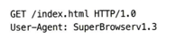
* URL 부분에 주목! -> '/index.html' 과 같이 부분 URL 만 표시
#### 클라 -> 프락시 -> 서버 요청
* 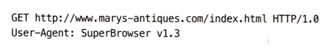
* 프락시로 요청을 보낼 때, 완전한 URL 을 보냄

#### 왜 원 서버로 보낼 때와 프락시로 보낼 때 URL 이 다를까? -> HTTP 역사와 디펜던시가 있는 부분
* 과거 상황
    * 원래의 HTTP 설계에서, 클라는 단일한 서버와 통신하는 것이 전재되어 있었다.
        * 가상 호스팅, 프락시에 대한 대비가 없었다.
    * 단일 서버와 통신을 가정한다면, 해당 서버의 호스트 명과 포트번호는 불필요한 정보였다.
        * 따라서 보내지 않았던 것이다.
* 현 상황
    * 프락시, 가상호스팅 등이 부상했다.
    * 이에 따라 부분 URL 만 보내는 것이 문제가 되었다.
        * ex> [클라 <-> 프락시 <-> 원 서버] 상황에서 [클라 -> 프락시]로 부분 URL 만 보내면 프락시 입장에선 어느 서버로 요청을 전달할 지 알 수 없었다.
* HTTP 1.0 에서의 해결책
    * 프락시 요청의 경우 완전한 URL 을 요구하는 것으로 문제를 해결???
        * 해결이라기 보단 프락시가 부상하면서 급한 불을 끈 느낌
* HTTP 1.1 에서의 해결책
    * 프락시건 뭐건 클라는 완전한 URL 을 다룰 것을 요구
    * but HTTP 1.0 시절의 스팩으로 이미 배치된 서버가 너무 많고 이 서버들은 완전한 URL 을 받아들이지 못하는 경우가 많다ㅠㅠ

#### 따라서 일반적으로 서버로는 부분 URL 을, 프락시로는 완전한 URL 을 보낼 필요가 있다.
* 우리는 HTTP 클라이언트를 사용하고 있고 이 클라이언트에게 프락시를 쓸지 말지 설정을 할 수 있다.
* HTTP 클라이언트는 프록시 사용 설정에 따라 똑똑하게 아래와 같이 동작한다.
    * 클라가 프록시를 사용하도록 설정된 경우 -> 완전한 URL 을 보낸다
    * 클라가 프록시를 사용하지 않도록 설정된 경우 -> 부분 URL 을 보낸다

#### Q) 리버스 프락시를 사용할 경우는 어떻게 될까?
* 리버스 프락시는 클라가 프록시를 사용하는지 조차 모르는 것이 특징이다.
* 따라서 클라 입장에선 명시적인 프락시 설정이 포함되지 않을 것이고
* 따라서 부분 URL 을 보낼 것 같다.
    * 즉, 리버스 프락시 구현 서버들은 부분 URL 에 대해 대비가 되어 있어야 할 것이다.

### 6.5.2 가상 호스팅에서 일어나는 같은 문제

    
내용

#### 프락시의 부분 URL 문제는 가상 호스팅 되는 웹 서버가 직면한 것과 같은 문제다.
* 가상으로 호스팅 되는 웹 서버는 여러 웹 사이트가 같은 물리적 웹 서버를 공유
* 요청 하나가 부분 URL /index.html 로 도착하면 가상 호스팅 되는 웹 서버는 해당 URL 가 실제 어느 가상 웹 사이트의 호스트 명인지 알 필요가 있으나 알 방법이 없다.

#### 문제 상황은 비슷하지만 프락시와 가상 호스팅은 각기 다른 방식으로 문제를 풀었다.
* 프락시 
  * 위에서 언급한 대로 완전한 URL 을 갖도록 함
* 가상 호스팅
  * 호스트와 포트에 대한 정보가 담겨 있는 Host 헤더를 요구

    
### 6.5.3 리버스 프락시, 인터셉트 프락시는 부분 URL 을 받는다
* 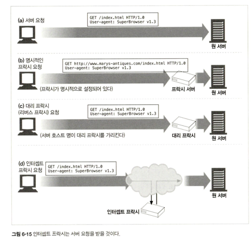
* 클라 입장에서 프락시를 사용하는지 모르는 경우는 부분 URL 을 보낼 수 밖에 없고 리버스 프락시와 인터셉트 프락시는 이에 맞춰서 개발할 수 밖에 없을듯

### 6.5.4 프락시는 프락시 요청과 서버 요청을 모두 다룰 수 있다.

내용

* 다목적 프락시 서버는 요청 메시지의 완전한 URL 와 부분 URL 을 모두 지원해야 한다.
  * 명시적인 프락시 요청에 대해서는 완전한 URL 를 사용하고 
  * 아니면 부분 URL 을 사용해야 하며, 
  * 웹 서버 요청의 겅우에는 가상 Host 헤더를 사용해야 한다.

#### 다목적 프락시 서버가 원 서버를 알아내는 방법
1. 완전한 URL 이 주어졌다면, 프락시는 그것을 사용해야 한다.
2. 부분 URL 가 주어졌고 Host 헤더가 있다면, Host 헤더를 이용해 원 서버의 이름과 포트를 알아내야 한다.
3. 부분 URL 가 주어졌으나 Host 헤더가 없다면, 다음의 방법으로 원 서버를 알아내야 한다.
   * 프락시가 원 서버를 대신하는 대리 프락시라면, 프락시에 실제 서버의 주소와 포트 번호가 설정되어 있을 수 있다.
   * (?)이전에 어떤 인터셉ㅇ트 프락시가 가로챘던 트래픽을 받았고, 그 인터셉트 프락시가 원 IP 주소와 포트번호를 사용할 수 있도록 해 두었다면, 그 IP 주소와 포트번호를 사용할 수 있다.
   * 모두 실패했다면, 프락시는 원 서버를 알아낼 수 있는 충분한 정보가 없다고 판단해야 한다.
     * 반드시 에러 메시지(보통 사용자에게 Host 헤더를 지원하는 현대적인 웹브라우저로 업그레이드 하라는 것) 를 반환해야 한다.

### 6.5.5 전송 중 URL 변경

내용

* 프락시 서버는 요청 URL 변경에 매우 신경을 써야 한다.
  * 무해해 보이는 사소한 URL 변경이라도 다운스트림 서버와 [상호운용성 문제]를 일으킬 수 있다.
#### 프락시 서버에서 흔하게 하는 변경 행동 예시
* URL 에서 기본 HTTP 포트를 명시적인 80 포트로 변경한다거나
* 잘못 사용한 예약된 글자를 올바르게 이스케이프하여 교체한다거나
* 이러한 무해해 보이는 변경일지라도 상호운용성 문제를 일으킬 가능성을 항상 염두해 둬야 한다.
####  프락시 서버는 가능한 관대하도록 애써야 한다.
* 프로토콜 경찰 처럼 되려고 하면 안된다.
* 특히 HTTP 명세는 일반적인 인터셉트 프락시가 URL 을 전달할 때 절대 경로를 고쳐 쓰는 것을 금한다.
* 유일한 예외는 빈 경로를 '/' 로 교체하는 것 뿐이다.

#### 요즘엔 대부분 이런 URL 변경 같은 것들은 프락시 설정에서 관리할 수 있다. 다양한 프락시 계층에서 각각의 프락시가 어떻게 설정되어 있는지 잘 이해하고 이를 바탕으로 동작 방식을 결정하는 것이 중요할 것임!

### 6.5.6 URL 클라이언트 자동확장과 호스트 명 분석(Hostname Resolution)

내용

* 브라우저는 프락시의 존재 여부에 따라 요청 URL 을 다르게 분석한다.
#### 프락시가 없다면
* 사용자가 타이핑 한 URL 를 가지고 그에 대응하는 호스트 명 또는 IP 주소를 찾는다.
* 발견한다면
  * 그에 대응하는 IP 주소들을 연결에 성공할 때 까지 시도해 본다.
* 발견하지 못한다면
  * 많은 브라우저들은 사용자가 호스트 명의 짧은 약어를 타이핑한 것으로 보고 자동화된 호스트명의 확장을 제공하고자 다음과 같은 몇가지 시도를 한다.

#### 브라우저의 호스트 명 확장 
* 일반적인 웹 사이트 이름의 가운데 부분만 입력했다면, 많은 브라우저는 'www.' 접두사를 붙이고 '.com' 접미사를 붙인다.
* 심지어 몇몇 브라우저는 해설할 수 없는 URL 을 서드파티 사이트로 넘기기도 하는데, 이 사이트는 오타 교청을 시도하고 사용자가 의도했을 URL 를 제시한다.
* 이뿐만 아니라, 대부분의 시스템에서 DNS 는 사용자가 호스트 명의 앞 부분만 입력하면 자동으로 도메인을 검색하도록 설정되어 있다.
  * ex> 'oreilly.com' 이라는 도메인이 있을 때 'host7' 을 입력한다면 그 도메인의 DNS 는 자동으로 'host7.oreilly.com' 을 찾아본다.

### 6.5.7 프락시 없는 URL 분석

내용

* 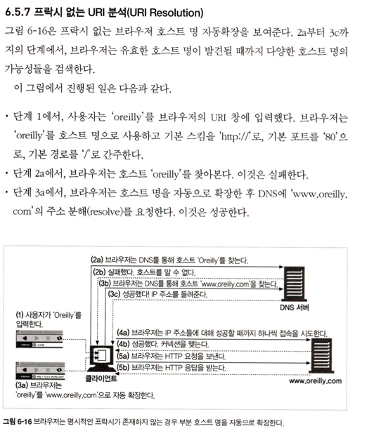

### 6.5.8 명시적인 프락시를 사용할 때의 URL 분석

내용

* 명시적인 프락시를 사용한다면, 브라우저는 6.5.7 에서 본 편리한 확장들중 어느 것도 더는 수행할 수 없다.
  * 브라우저의 URL 이 프락시를 그냥 지나쳐 버리기 때문이다.
* 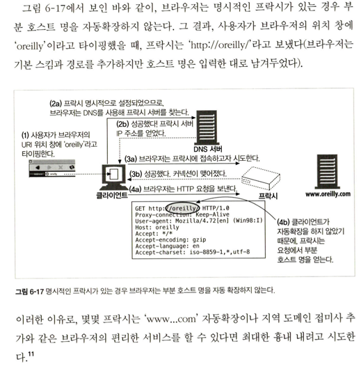

#### 명시적 프락시가 있을 때와 없을 때 비교
* 명시적 프락시가 없을 경우
  * 원 서버를 알기 위해 DNS 에 질의한다.
* 명시적 프락시가 있을 경우
  * 프락시 서버를 알기 위해 DNS 에 질의한다.
  * 명시적 프락시를 사용할 경우, 프락시는 사용자가 입력한 원 서버 정보를 위임하기만 한다.
  * 사용자가 입력한 원 서버 정보를 가지고 추론하던 뭘 하던 그건 프락시의 책임으로 위임하는 것임
    * 즉, 명시적 프락시를 사용할 경우 브라우저에서 추론의 책임이 프락시로 위임된다.
    * 근데, 프락시가 그걸 충실히 수행할 수 있는지 없는지는 내가 쓰는 프락시를 잘 알아봐야 할 필요가 있음

-----------------

# 6.6 메시지 추적

### 배경
* 오늘날 웹 요청이 클라이언트에서 서버로 향하는 도중에 다수의 프락시를 지나는 것은 아주 흔한 일임
* 이러한 프락시는 여러 벤더에 의해 개발되고 서로다른 기능과 버그 들을 가지고 있음
* 이러한 추세가 점 강해지면서, 서로 다른 프락시를 넘나드는 메시지의 흐름을 추적하고 문제점을 찾아내는 일이 점점 더 중요해 지고 있음

### 6.6.1 Via 헤더

내용

* 메시지가 지나가는 각 중간 노드(프락시나 게이트웨이)의 정보를 나열하는 헤더
* 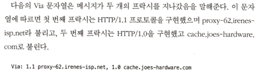
* 목적
  1. 메시지 전달 추적
  2. 메시지 루프 진단
  3. 요청과 응답에 관여하는 모든 메시지 발송자들의 프로토콜을 다루는 능력을 추적
  4. 네트워크의 라우팅 루프 탐지
    * 프락시는 요청을 보내기 전에 자신을 가리키는 유일한 문자열을 Via 헤더에 삽입해야 하며 
    * 네트워크 라우팅 루프가 있는지 탐지하기 위해 이 문자열이 들어온 요청에 있는지 검사
#### Via 문법
* 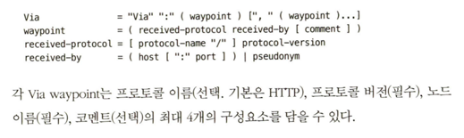

자세히 보기

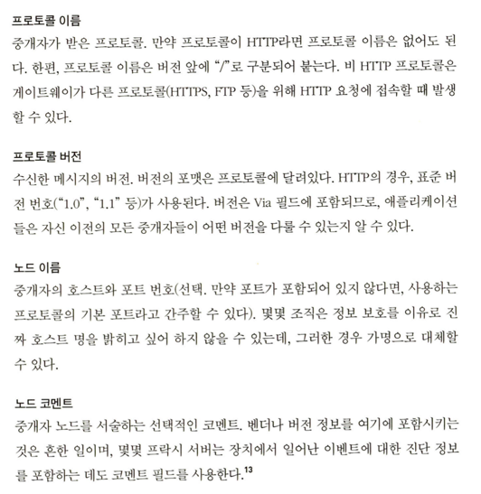

#### Via 요청과 응답 경로
* 요청 메시지와 응답 메시지 모두 같은 프락시를 같은 TCP Connection 을 통해 지난다
* 따라서, 응답 메시지는 요청과 같은 경로를 되돌아간다.
* 많약 요청 메시지가 프락시 A->B->C 를 지났다면 그에대한 응답 메시지는 프락시 C->B->A 를 지난다.
* 즉, 응답의 Via 헤더는 거의 언제나 요청의 Via 헤더와 반대다.

#### Via 와 게이트웨이
* 몇몇 프락시는 서버에게 비 HTTP 프로토콜을 사용할 수 있는 게이트웨이 기능을 제공
* Via 헤더는 이러한 프로토콜 변환을 기록하므로 HTTP 애플리케이션은 프락시 연쇄에서 프로토콜 능력과 변환이 있었는지를 알아챌 수 있다.
* ex>
  * 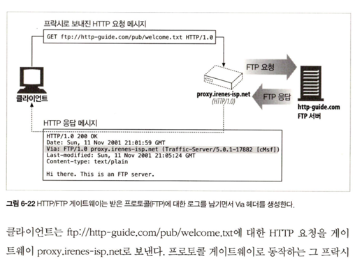
* Server 헤더와 Via 헤더
  * Server 응답 헤더 필드는 원 서버에 의해 사용되는 소프트웨어를 알려준다.
  * ex>
    * 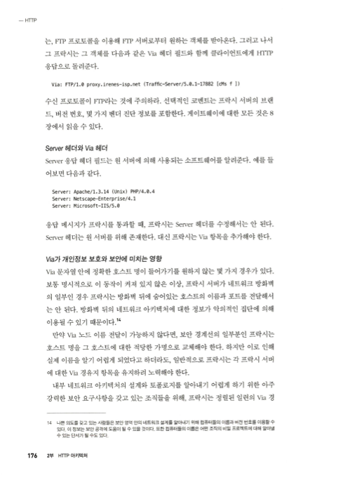
  * 응답 메시지가 프락시를 통과할 때, 프락시는 Server 헤더를 수정해서는 안 된다.
    * Server 헤더는 원 서버를 위해 존재한다.
    * 대신, 프락시는 Via 항목을 추가해야 한다.

#### Via 가 개인정보 보호와 보안에 미치는 영향
  * 프락시는 보통 별도 설정이 없다면 프록시의 구체적인 정보를 알려주기 보단 적당한 가명으로 교체하여 Via 헤더에 내용을 추가해야 한다.
    * 예를들어, 방화벽 뒤에 숨어있는 호스트의 이름과 포트를 전달하게 되면 네트워크 아키텍처에 대한 정보가 악의적인 집단에 의해 이용될 수 있다.
  * 적당한 가명을 사용하여 실제 이름을 알기 어렵게 되었다고 하더라도, 프락시 서버는 Via 에 경유지 항목을 유지하려 노력해야 한다.

### 6.6.2 TRACE 메서드

내용

* 프락시 계층을 이루게 되면 HTTP 요청의 복잡성이 증가
  * 따라서, HTTP 프락시 네트워크를 통해 홉에서 홉으로 전달될 때마다 메시지의 내용이 어떻게 변하는지 편리하게 관찰할 방법이 필요

#### Trace 메서드(내가 보낸 요청이 실제 서버에 전달될 때 어떤 모습을 하고있는지 볼 수 있는 방법)
* 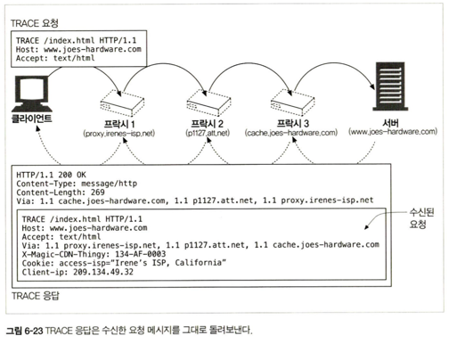
* HTTP 1.1 스팩에 추가
* 요청 메시지를 프락시의 연쇄를 따라가면서 어떤 프락시를 지나가고 어떻게 각 프락시가 요청 메시지를 수정하는지 추적할 수 있는 도구
* TRACE 요청이 목적지 서버에 도착했을 때, 서버는 전체 요청 메시지를 HTTP 응답 메시지의 본문에 포함시켜 송신자에게 그대로 돌려보낸다.
* TRACE 응답이 도착하면, 클라는 서버가 받은 메시지와 그 메시지가 지나간 프락시들의 목록(Via 헤더 안에 있다)을 검사할 수 있다.
* Max-Forwards
  * 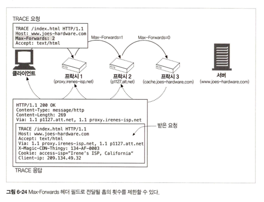
  * 일반적으로 TRACE 메시지는 중간에 프락시들이 몇 개나 있든 목적지 서버로의 모든 경로를 여행한다.
  * TRACE 와 OPTIONS(?) 요청의 프락시 홉 개수를 제한하기 위해 Max-Forward 헤더를 사용
  * 이 헤더는 요청 메시지가 몇 번 더 다음 홉으로 전달될 수 있는지 말해주는 정수 하나를 담고 있다.
  * 홉을 하나 지날 때 마다 정수를 감소하다가 0이 되면 그 지점이 최종 서버가 아닐지라도 무조건 거기서 응답을 돌려줘야 한다.
  * 따라서, 연쇄의 어떤 특정 홉에서의 요청 메시지를 보기 위해 Max-Forwards 를 사용할 수 있다.

-----------------------------------

# 6.7 프락시 인증
  * 제한된 콘텐츠에 대한 요청이 프락시 서버에 도착하면 
    * 407 Proxy Authorization Required 상태 코드를 내려주면서
    * 어떻게 그러한 자격을 제출할 수 있는지 설명해주는 Proxy-Authenticate 헤더 필드와 함께 반환할 수 있다.
  * 클라는 407 응답을 받으면, 로컬 DB든 사용자 입력이든 요구되는 자격을 수집한다.
  * 자격을 획득하면 클라는 요구되는 자격을 Proxy-Authorization 헤더 필드에 담아서 요청을 다시 보낸다.
  * 자격이 유효하다면, 프락시는 원 요청을 연쇄를 따라 통과, 유효하지 않다면 407 응답을 보낸다.
* 프락시 인증의 경우 일반적으로 인증에 참여하는 프락시가 연쇄적이라면 잘 동작하지 않는다.
    
### 최근에도 407 응답을 많이 사용할까?
* 상태 코드 정리
    * 401 -> 인증 실패 
    * 403 -> 인가 실패
    * 407 -> 프락시에 의한 인증 실패
* 굳이 407과 401 을 나눌까?
    * 명시적 프락시를 사용할 경우는 407 을 줄 수도 있을 것 같다.
    * nginx 같은 리버스 프락시는 401 을 내려주는게 표준인것 같다.
-----------------------------------

# 6.8 프락시 상호 운용성

### 배경
* 클라, 서버, 프락시는 HTTP 명세의 여러 버전에 대해 여러 벤더에 의해 만들어짐
* 보편적인 기능은 잘 맞겠지만 간혹 호환이 안되는 부분이 있을 수 있음
* 프락시 서버는 서로 다른 프로토콜을 구현했을 수도 있고 골치아프게 이상한 동작을 할 수도 있는 클라와 서버 사이를 중계해야함.

### 6.8.1 지원하지 않는 헤더와 메서드 다루기
* 프락시 서버는 넘어오는 헤더를 모두 이해하지 못할 수도 있음
  * 이해할 수 없는 헤더 필드는 반드시 그대로 전달해야함
  * 같은 이름의 헤더 필드가 여러 개 있는 경우에는 그들의 상대적인 순서도 반드시 유지해야 한다.

