# 코틀린 학습 공간

### 관련 정리 공간
1.  노션: https://keen-derby-c16.notion.site/a116f6e80f0c450a84142c8a6874269d
2.  블로그: 추가예정

### 학습 방향성
* 코틀린 vs 자바 비교하면서 코틀린 코드가 왜 좋고 그 사상이 뭔지 이해하기
    * 코틀린 코드와 자바 코드 동시에 작성해보자
* 코틀린 언어 특성 이해하기
* 코틀린과 친해지기
* 코틀린의 유틸과 친해지기
* 코루틴

### 부록
* kotlin 학습을 하게 되면서 얻는 부가적인 학습 경험은 `extra` 하위에 정리한다.

---
## 2장: 코틀린 기초
### 2장에서 다루는 내용
* 함수, 변수, 클래스, enum, 프로퍼티를 선언하는 방법
    * 프로퍼티가 뭘까?? 
* 제어 구조
* 스마트 캐스트
    * 타입 검사와 타입 캐스트, 타입 강제 변환을 하나로 엮은 기능!
* 예외 던지기와 예외 잡기

### 2.1 기본 요소: 함수와 변수
* 함수 작성 문법
    * 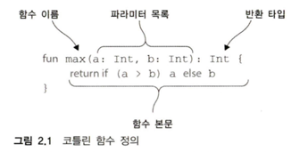
* 문(statement) vs 식(expression)
    * expression
      * 값을 만들어 낸다
      * 다른 식의 하위 요소로 계산에 참여할 수 있다
      * ex> 3항 연산자
    * statement
      * 가장 안쪽 블록의 최상위 요소로 존재
      * 아무 값을 만들어내지 않는다.
      * ex> java 의 while 문
    * 제어 구조와의 관계
      * java -> 모든 제어 구조가 문으로 구성
      * kotlin -> 루프를 제외한 대부분의 제어 구조가 식으로 구성
        * 제어 구조를 표현하는 방식이 다양할 수록 다양한 코드 패턴을 간결하게 표현할 수 있는 유연성이 생김
* 변수 작성 문법
  * 
    * 특징 1 -> 자바와 달리 타입이 변수 이름 뒤에 선언된다.
    * 특징 2 -> 선언과 동시에 초기화 하는 경우 타입 추론이 동작하여 변수 타입 생략이 가능하다
      * 변수 선언만 할 경우 반드시 타입을 명시해야 함
    * 특징 3 -> 변수 이름 : 타입 말고도 val 이라는 키워드가 있다(뒤에서 다룸)
* val 과 var
  * val
    * 값을 뜻하는 value 에서 따옴
    * 변경 불가능한 참조를 저장하는 변수
    * 자바로 말하면 final 변수(constant 개념은 아님, 참조를 바꿀 수 없다는 의미이다!!!)
  * var
    * 변수를 뜻하는 variable 에서 따옴
    * 변경 가능한 참조
      * 변수의 타입은 한번 선언되면 바꿀 수 없음에 주의
    * 자바의 일반 변수와 같음
* 불변 변수와 함수형 프로그램
  * 가능하면 모든 변수를 val 키워드를 사용해 불변 변수로 선언하고 나중에 꼭 필요하면 var 로 변경할것
  * 변경 불가한 참조와 변경 불가한 객체를 부수 효과가 없는 함수와 조합해 사용하면 코드가 함수형 스타일에 가까워진다.

* 코틀린은 문자열 템플릿 기능을 지원
  * ex> println("Hello $name!")
  * 자바 문자열 접합보다 간결하게 사용 할 수 있도록 하기 위한 언어 차원의 지원
  * "Hello, ${args[0]}" 같은 복잡한 식도 중괄호로 둘러싸서 문자열 템플릿 안에 넣을 수 있다.
  * 되도록 중괄호를 사용하는 것을 습관화 하자
    * $namehello 이런식으로 하면 namehello 를 인식해버림 -> ${name}hello 로 써야 name 을 변수 명으로 인식

### 2.2 클래스와 프로퍼티
* 프로퍼티 -> 말 그대로 클래스의 특성 이라고 이해해야 한다.
  * 필드와 접근자를 한데 묶은 개념
  * val(value)
    * 읽기 전용 프로퍼티를 선언
    * java 로 치면, private 필드와 getter 를 만들어 준다.
    * object.getter 방식이 아니라 object.field 방식을 통해 값을 getting 할 수 있다.
    * object 밖 말고 안쪽에서도 val 의 참조는 변경 불가하다
      * 즉, 일반 val 은 final 이고 클래스 프로퍼티의 val 은 final + private field + public getter 로 이해하기 
  * var(variable)
    * 변경 가능한 프로퍼티를 선언
    * java 로 치면, private 필드와 getter & setter 를 만들어 준다.
    * object.getter 방식이 아니라 object.field 방식을 통해 값을 getting & setting 할 수 있다.
  * 프로퍼티는 꼭 필드를 가져야 할까?
    * 대부분의 프로퍼티에는 그 프로퍼티의 값을 저장하기 위한 필드가 있다.
      * 이를 프로퍼티를 뒷받침하는 필드 라 한다.
    * 하지만 원한다면 프로퍼티 값을 그때그때 계산할 수도 있다.
      * 커스텀 게터를 작성하면 그런 프로퍼티를 만들 수 있다.
      * 아마 프로퍼티에 값을 setting 하고 싶을 경우 필드가 뒷받침 되는게 자연스러울 듯
  * 커스텀 접근자
    * 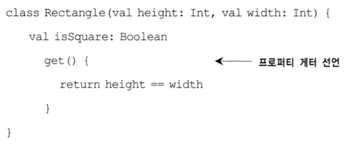
    * 이러한 방식을 통해 필드 없이도 값을 getting 할 수 있는 프로퍼티를 만들 수 있음
  * 파라미터가 없는 함수를 정의하는 것 vs 커스텀 케터를 정의하는 것
    * 구현상으론 완전히 동일
    * 일반적으로 클래스의 특성을 정의하고 싶다면 프로퍼티로 정의하는 것이 문법적으로 의도가 명확한 코드가 될 것이다.
* 코틀린의 소스 구조: 디렉터리와 패키지
  * java 보다 간결하게 구성할 수 있으나 java 호완성을 위해 java 규칙과 동일하게 구성하는 것을 추천

### 2.3 선택 표현과 처리: enum과 when
```
* when 은 자바의 switch 를 대치하되 훨씬 더 강력하며 자주 사용됨
```
* enum 클래스 정의
  * 코틀린에서 enum 은 소프트 키워드
    * enum 은 class 앞에 있을 경우 특별한 의미를 지니지만 다른 곳에서는 이름에 사용할 수 있다.(즉, val enum=3 같은 코드가 가능하다)
  * 자바와 마찬가지로 enum 은 단순 값만 열거하는 존재가 아님
    * 프로퍼티나 메소드 정의 가능
    * 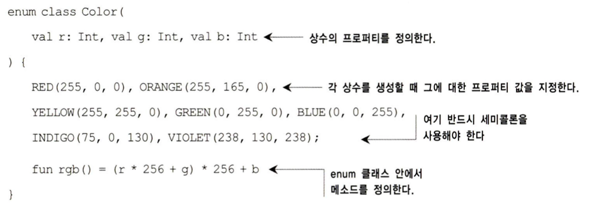
      * 참고: 이 예제에서는 코틀린에서 유일하게 세미콜론(;)이 필수인 부분을 볼 수 있다.
      * enum 클래스 안에 메소드를 정의하는 경우 반드시 enum 상수 목록과 메소드 정의 사이에 세미콜론을 넣어야 함

* when 으로 enum 클래스 다루기(feat. java 의 switch)
  * when 은 식임 -> 메소드에 코드 블락({}) 없이 = 으로 사용 가능
  * 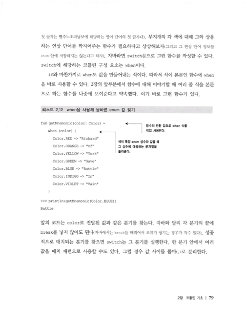
* when 과 임의의 객체를 함께 사용
  * when 의 분기 조건은 임의의 객체를 허용(java 의 switch 는 분기 조건에 상수만을 사용할 수 있음) -> 코드의 간결성 up
  * 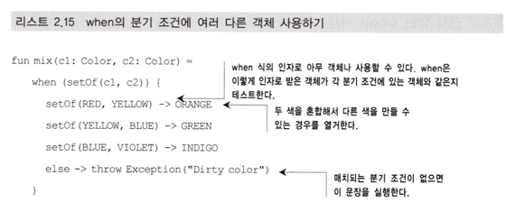
* 인자가 없는 when 사용
  * when 에 아무 인자도 없으려면 각 분기의 조건이 불리언 결과를 계산하는 식 이어야 한다.
  * 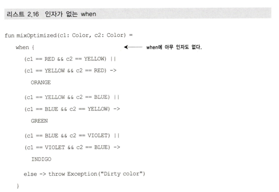
    * 임의 객체를 함께 사용할 때 발생하는 불필요한 객체 생성을 방지할 수 있다.
    * 코드의 가독성과 성능의 trade off 에서 선택의 여지가 있는 부분이다.

### (tip) 스마트 케스트 사용하기(feat. kotlin [is] & [immutable])
* 자바에서 
  * 타입 검사를 위해 instanceof 메소드를 사용한다.
  * 타입 검사 후에 명시적으로 한번 더 타입 케스팅을 해 줘야 하는 불편함이 있다.
* 코틀린에서
  * 타입 검사를 위해 is 를 사용한다.
  * 일단 is 검사가 성공하고 나면 해당 코드 블락에선 is 로 검사한 타입으로 컴파일러에 의해 자동 타입 캐스팅이 되는데, 이걸 스마트 캐스트라고 한다.
  * ex> 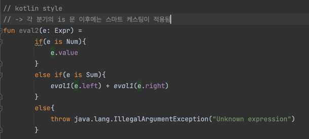
  * 스마트 캐스트는 is 로 변수에 든 값의 타입을 검사한 후 그 값이 바뀔 수 없는 경우에만 작동함!
    * ex1> 클래스의 프로퍼티에 대해 스마트 캐스트를 사용하려면 그 프로퍼티는 반드시 val 이어야 함 + 커스텀 접근자도 스마트 캐스팅이 불가
    * 즉, 스마트 캐스트가 발생하는 시점에 값들을 확정할 수 있어야 함

### (tip) `블록의 마지막 식이 블록의 결과` 라는 규칙은 블록이 값을 만들어내야 하는 경우 항상 성립
* 이 규칙이 유일하게 함수에서는 성립 안함
  * 함수에선 리턴문이 산발적으로 나타날 수 있기 때문에 명시적으로 return 키워트를 사용해야 함


### 2.4 대상을 이터레이션: while & for 루프
* while 루프
  * 자바와 거의 동일
* for 루프
  * for-each 루프만 존재
----
## 3장. 함수의 정의와 호출

### 3-1. 코틀린에서 컬렉션 만들기
* 컬렉션을 만드는 유용한 메소드를 제공
* 코틀린의 컬렉션은 내부적으로 자바의 컬렉션을 그대로 사용하면서 이를 확장
  * 기존 자바 코드와의 호완성을 위함
  * 확장을 통해 기존 자바 클래스보다 더 많은 기능을 제공

### 3-2. 함수를 호출하기 쉽게 만들기
#### 기본 셈플 함수 형태
```kotlin
fun <T> joinToString(
        collection: Collection<T>,
        separator: String,
        prefix: String,
        postfix: String
        ) : String {
    val sb = StringBuilder(prefix)
    for ((idx, ele) in collection.withIndex()) {
    sb.append(ele)
    if(collection.size -1 > idx) sb.append(separator)
    }
    sb.append(postfix)
    return sb.toString()
}
```
* 호출 코드
```kotlin
fun main(args: Array<String>) {
    val mySet = hashSetOf(1,2,3)
    println(joinToString(mySet, "~","[","]"))
}
```
* 불편사항
  * 메소드 호출부를 보면 어떤 인자가 어떤 역할을 하는지 명시적으로 알기 어려움

#### 3-2-1 이름 붙인 인자 <- 함수를 사용하는 쪽의 편의
* 메소드 호출부에 이름을 명시적으로 지정할 수 있음
```kotlin
fun main(args: Array<String>) {
    val mySet = hashSetOf(1,2,3)
    println(joinToString(mySet, separator = "~",prefix = "[",postfix = "]"))
}
```
* 이름을 지정하면 메소드 호출 시 파라미터 순서 안지켜도 상관없음
#### 3-2-2 디폴트 파라미터 <- 함수를 선언하는 쪽의 편의
```kotlin
fun <T> joinToString(
        collection: Collection<T>,
        separator: String = ",",
        prefix: String = "[",
        postfix: String = "]"
        ) : String {
    val sb = StringBuilder(prefix)
    for ((idx, ele) in collection.withIndex()) {
    sb.append(ele)
    if(collection.size -1 > idx) sb.append(separator)
    }
    sb.append(postfix)
    return sb.toString()
}
```
* 호출하는 쪽에서 여러 형태로 호출 가능
  * 메소드오버로딩의 부분을 줄여줌
  * (메소드 오버로딩도 일종의 중복이라고 볼 수 있음)

#### 3-2-3. 정적인 유틸리티 클래스 없애기: 최상위 함수와 프로퍼티
* 코틀린의 메소드와 프로퍼티는 반드시 클래스 내부에 선언할 필요가 없음
* 클래스 밖에 선언된 메소드와 프로퍼티를 최상위 메소드, 프로퍼티라함
* 최상위 메소드, 프로퍼티는 자바의 static 과 유사한 성질을 가짐(내부적으로 동일)

### 3-3. 메소드를 다른 클래스에 추가: 확장 함수와 프로퍼티
* 개념
  * 어떤 클래스의 멤버 메소드인것처럼 호출
  * 하지만, 실제로 멤버 메소드는 아니고 외부에 정의된 정적 메소드
  * 프록시처럼 클라이언트는 멤버 메소드를 호출한다고 생각하지만 내부적으로는 그 멤버 메소드를 확장한 메소드를 호출하게 됨
  * 이러한 형태로 기존 멤버 메소드에 부가기능 추가 & 접근제어를 가능하게 함
* 문법
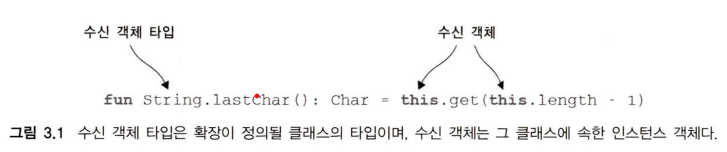
  * this 키워드 생략 가능
* 자바에서의 노출
  * 코틀린의 확장함수는 자바로 치면 수신 객체 타입의 인스턴스를 가장 처음 인자로 받는 정적 메소드로 표현됨
  
* 예시: joinToString 메소드를 Collection<E> 의 확장함수 형태로 구현
```kotlin
fun <T> Collection<T>.joinToString(
        separator: String,
        prefix: String,
        postfix: String
) : String{
    val sb = StringBuilder(prefix)
    for ((idx, ele) in this.withIndex()) {
        sb.append(ele)
        if(this.size -1 > idx) sb.append(separator)
    }
    sb.append(postfix)
    return sb.toString()
}
```
* 호출하는 부분
```kotlin
fun main(args: Array<String>) {
    val mySet = hashSetOf(1,2,3)
    println(mySet.joinToString(separator = "~",prefix = "[",postfix = "]"))
}
```
* 확장함수는 내부적으로 자바의 static 메소드로 동작
  * 오버라이딩이 불가능
  * 동적바인딩이 아니라 정적바인딩됨
* 멤버 메소드와의 우선순위
  * 동일한 형태의 클라이언트 호출 코드가 있으면 멤버메소드가 확장함수보다 우선순위 높음

* 확장 프로퍼티
  * 확장 함수와 마찬가지로 
    * 클래스 외부에서 정의
    * 수신객체클래스가 추가된 형태
  * 클래스 외부에 정의되기 때문에 상태를 저장할 방법이 없음
    * 즉, 뒷받침하는 필드가 없음

### 이후 문자열 부분은 생략

## 4장: 클래스, 객체, 인터페이스

### 4.1 클래스 계층 정의
#### 4.1.1 코틀린 인터페이스
* 자바 8 인터페이스와 비슷
* 추상메소드, 구현이 있는 메소드도 정의 가능
  * 구현있는 메소드 == 자바 8의 디폴트 메소드
  * 자바8 디폴트 메소드는 default 키워드를 반드시 사용해야하지만 코틀린 인터페이스는 아니다
  * Q) 많약 2개 이상의 인터페이스를 상속받은 클래스에서, 각 인터페이스가 동일한 시그니쳐의 디폴트메소드를 정의한다면?
    * 컴파일 오류가 발생 -> 명시적으로 겹치는 시그니처 메소드를 오버라이딩 해야함을 알려줌
* 다만, 상태(필드) 는 가질 수 없음
* 메소드 상속하는 쪽에서 override 를 필수로 붙여야함
  * override 를 강제하여 얻는 이득 -> 실수로 상위클래스의 메소드를 오버라이드하는 것을 컴파일러가 잡아줌

#### 4.1.2 open, final, abstract 변경자: 기본적으로 final
* 자바에서 모든 메소드는 기본적으로 상속이 가능함(즉, final 이 아님)
  * 이로인해 발생하는 문제 -> 취약한 기반 클래스
    1. 하위 클래스가 기반 클래스에 대해 가졌던 가정이 기반 클래스를 변경함으로써 깨지는 문제
    2. 기반 클래스 입장에서 모든 하위 클래스를 분석하는것은 불가능에 가깝기 때문에, 이런 문제를 방지하기위해선, 상속에대한 엄격한 규칙을 제공할 필요가 있음
    3. 더군다나 하위클래스의 잘못된 오버라이딩으로 인해 기반클래스의 상태가 변경될 수도 있음
    4. 한마디로, 상속은 기반-하위 클래스 사이의 강결합을 유발하기때문에 가급적 지양해야함
* 코틀린의 메소드는 기본적으로 final 이다.
  * 기본적으로 상속을 지양한다는 사상으로부터 코틀린의 메소드는 기본 final 로 만듦
  * 특별히 하위 클래스에서 오버라이딩하게 의도된 메소드가 아니라면 모두 final 로 만들자는 사상
* 코틀린에선 오버라이딩이 의도된 메소드는 명시적으로 open 변경자를 달아줘야함
* 오버라이딩한 메소드는 기본적으로 open 이다
* 코틀린의 abstract 와 자바의 abstract 는 거의 같다
  * 코틀린의 abstract 는 기본적으로 open 이다
  * 추상 클래스에 구현된 비추상 메소드는 기본적으로 final 이다
* 인터페이스는 항상 open 이다
  * 인터페이스는 open, final, abstract 사용 불가
* 정리
  * 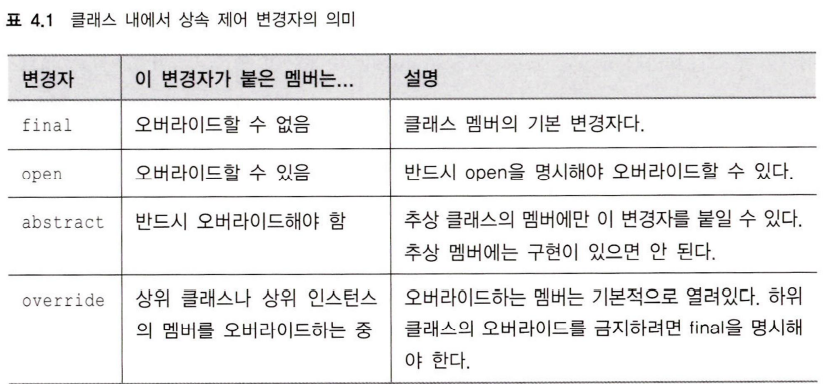

#### 4.1.3 가시성 변경자: 기본적으로 공개
* 기본적으로 public
* 정리
  * 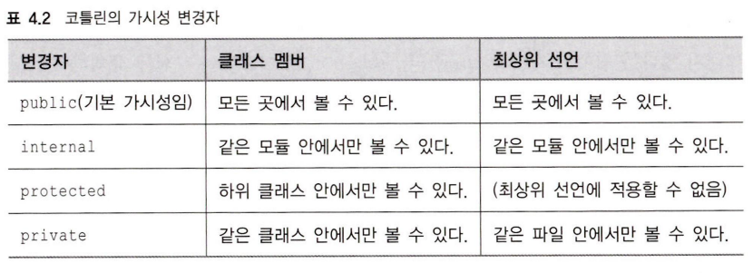

#### 4.1.4 내부 클래스와 중첩된 클래스: 기본적으로 중첩된 클래스
* 우선 내부 <-> 중첩 차이가 뭘까?
  * 자바의 하위 class => 내부 클래스
    * 상위 클래스의 인스턴스를 통해서만 생성 가능  
    * 상위 클래스 인스턴스의 참조를 항상 가지고있음
  * 자바의 하위 static class => 중첩 클래스
    * 그냥 독립된 클래스
* 코틀린은 기본적으로 중첩된 클래스
* 정리
  * 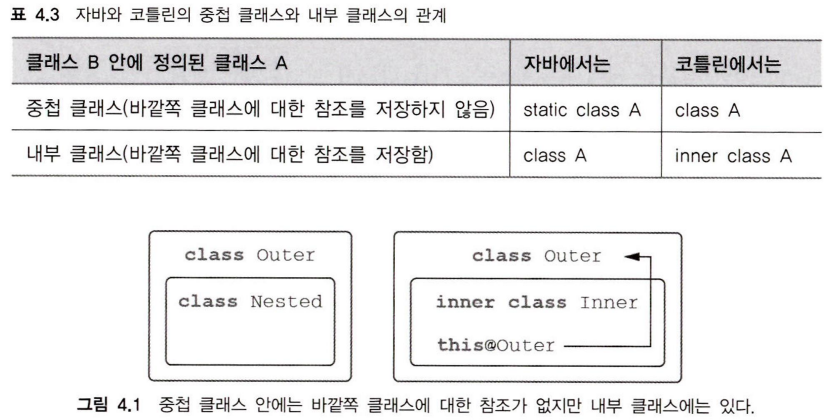

#### 4.1.5 봉인된 클래스: 클래스 계층 정의 시 계층 확장 제한
* 예제 (문제상황 == 봉인된 클래스 개념이 나온 배경)
  * 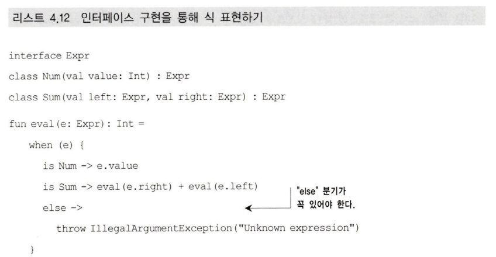
    * Expr 의 구현체인 Num 과 Sum
    * Expr 의 구현체는 이것 말고도 더 늘어날 수 있고 얼마나 많은 구현체가 있는지 이 코드만 보고 알 수 없음
    * 이로인해 항상 타입 비교 시 else 문을 넣어 부가적인 처리를 해야함 -> 불필요한 부가 코드
    * else 이외의 모든 조건에서 실제로 모든 case 를 커버하는지 컴파일 타임에는 알 수 없음
* 위 문제에 대한 답으로 sealed 클래스가 도입됨
  * 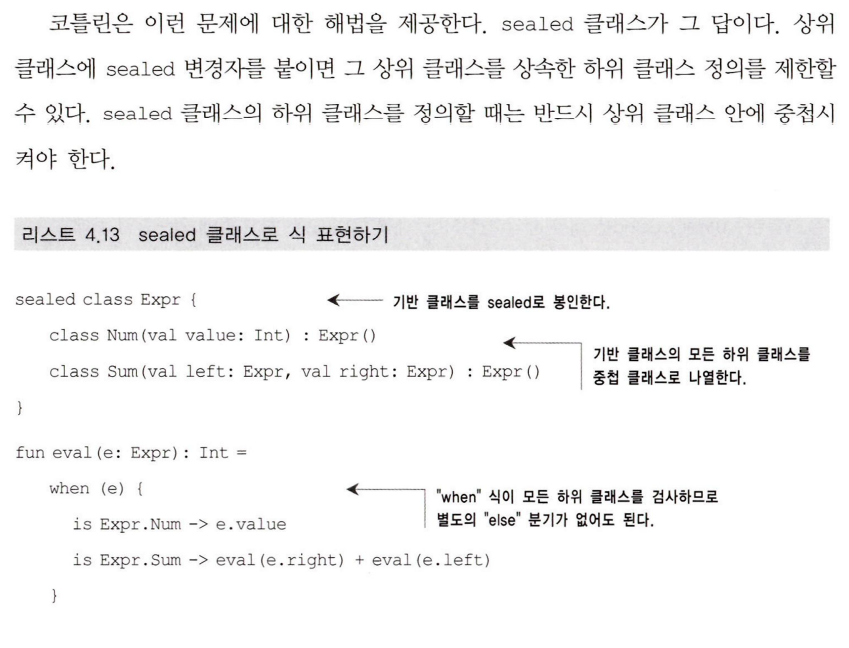
  * 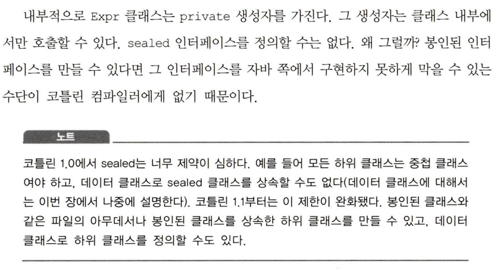

### 4.2 뻔하지 않은 생성자와 프로퍼티를 갖는 클래스 선언
#### 4.2.1 클래스 초기화: 주 생성자와 초기화 블록
* 주 생성자 목적
  1. 생성자 파라미터 지정
  2. 생성자 파리미터에 의해 초기화 되는 프로퍼티 정의
* 주 생성자의 변천사
  1. 본모습: 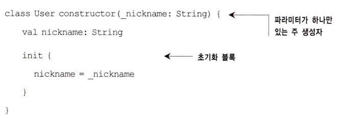
  2. 1단계 생략: 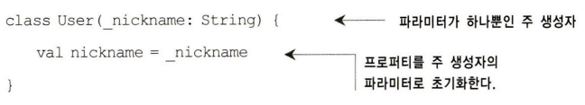
  3. 최종 생략본: 
* 생성자도 메소드임 -> 디폴트 파라미터 지정 가능
* 주 생성자 생략본 + 디폴트 파라미터 지정으로 인해 흔히 자바에서 여러 생성자를 오버로딩 하는 형태를 대부분 커버가능
* 상속 상황에서의 생성자
  * 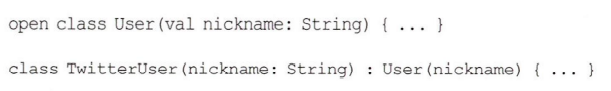
    * 하위 클래스는 기반 클래스의 생성자를 호출해야함
    * 위 이미지는 호출하는 방법을 보여줌(-> 생략된 형태)

#### 4.2.2 부 생성자: 상위 클래스를 다른방식으로 초기화
* 상속이 아닌 상황에선 주 생성자 + 디폴트 파라미터로 대부분의 경우가 커버되는듯
* 상속하는 상황에서 생성자 문법이 제약이 있다.
  * 기반 클래스를 다양한 방식으로 생성하는 방식을 주 생성자만으로 지원하지 못함
* 따라서, 기반 클래스를 다양한 방법으로 생성하고싶을땐, 아래와같이 부 생성자를 작성한다
  * 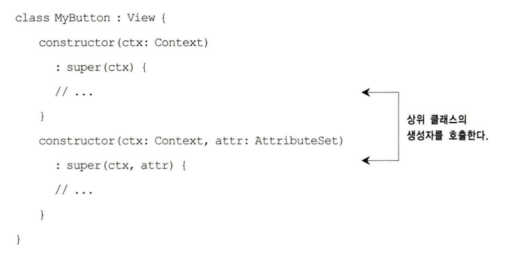
* 이것 말고도 불가피하게 파라미터 목록이 다른 경우에는 부 생성자를 여럿 둬야함

#### 4.2.3 인터페이스에 선언된 프로퍼티 구현
* 인터페이스에 프로퍼티는 선언 가능 
  * 상태를 저장할 수 없기 때문에, 뒷받침하는 필드를 가질수는 없음
  * 뒷받침하는 필드는 구현체에서 만들어야함
* 인터페이스 예시
```kotlin
interface User {
    val nickname: String
}
```
* 주 생성자에서 오버라이드한 프로퍼티
```kotlin
class PrivateUser(override val nickname: String) : User
```
  * 내부적으로 getter 가 생성되고 이 getter 의 뒷받침하는 필드가 만들어짐
  * 객체 생성 시 뒷받침하는 필드가 초기화 되고 이후에는 접근만 가능
* 커스텀 게터
```kotlin
class SubscribingUser(val email: String): User {
    override val nickname: String 
        get() = email.substringBefore('@')
}
```
  * 객체 생성 시 email 이 초기화됨
  * nickname 의 뒷받침하는 필드는 없고 커스텀게터를 통해 값을 얻음
  * 커스텀 게터에서는 매번 email.substringBefore('@') 코드를 실행해서 값을 리턴
* 프로퍼티 초기화 식
```kotlin
class FaceBookUser(val accountId: Int): User {
    override val nickname = getFaceBookId(accountId)
}
```
  * 객체 생성 시 한번만 프로퍼티 초기화 식이 실행되어 nickname 에 값이 세팅됨

* 인터페이스에 게테와 세터가 있는 프로퍼티 선언 가능!
  * 상태(필드) 만 없으면 다 된다!
```kotlin
interface User {
    val email: String
    val nickname: String
      get() = email.substringBefore('@')
}
```
  * User 의 구현은 반드시 email 은 override 해야하지만 nickname 은 옵셔널

##### 4.2.4 게터와 세터에서 뒷받침하는 필드에 접근 -> field 키워드!
* 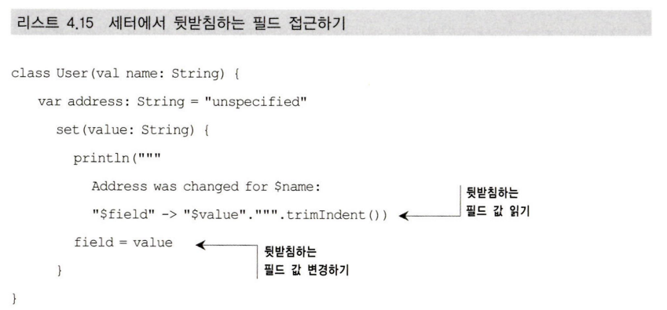
* 위 예시처럼 게터와 세터에서 뒷받침하는 필드에 접근하기위해 field 키워드를 사용
  * 게터에선 field 값을 읽을수만있고
  * 세터에선 field 값을 읽거나 변경할 수 있음

#### 4.2.5 접근자의 가시성 변경
* 클래스 내부에서는 변경 가능(var) 속성을 가지지만 밖에서는 읽기만 가능하도록 만드는 방법
```kotlin
class LengthCounter { 
  var counter: Int = 0
    private set
  
  fun addWord(word: String) {
      counter += word.length
  }
}
```

### 4.3 컴파일러가 생성한 메소드: 데이터 클래스와 클래스 위임

#### 4.3.1 모든 클래스가 정의해야하는 메소드: toString, equals, hashCode
* sample class
```kotlin
class Client(val name: String, val postalCode: Int)
```
1. toString
  * 기본 제공되는 객체의 문자열 표현은 Client@b684286 형태
  * 이 기본 구현을 변경하려면 toString method 를 ovveride 해야 한다
  ```kotlin
  class Client(val name: String, val postalCode: Int) {
      override fun toString() = "Client(name=$name, postalCode=$postalCode)"
  }
  ```
2. equals
  * 객체의 동일성은 == 를 통해 확인한다 <- 참조가 같은지 확인
  * 객체의 동등성은 만드는 객체에따라 정의하기 나름인데, 이 정의에 따라 equals 메소드를 override 한다
  * 일반적으로 객체가 가진 모든 프로퍼티가 일치하면 동등하다는 규칙을 사용한다
3. hashCode
  * 자바에서는 equals 를 override 하면 반드시 hashCode 도 override 해야한다
  * JVM 언어에서는 아래와 같은 규칙이 있다
    * equals() 가 true 를 반환하는 두 객체는 반드시 같은 hashCode 를 가져야 한다
  * java 의 모든 hash container 는 위 규칙을 기반으로 동작한다
    * 즉, hash container 에서 객체를 비교할 때 효율성을 위해 equals 를 먼저 보지 않고 우선 hashCode 를 비교해보고 
      * hashCode 가 다르면 다른 객체라 간주
      * hashCode 가 같으면 그때 equals 를 호출해서 진짜 같은지 다시 확인

#### 4.3.2 데이터 클래스: 모든 클래스가 정의해야하는 메소드를 자동 생성
* 어떤 클래스가 데이터를 저장하는 역할만 수행한다면, toString, equals, hashCode 는 반드시 override 해야함
* data 라는 변경자를 클래스 앞에 붙이면, 위 3개의 메소드를 포함한 여러 유용한 메소드를 자동 생성해준다

.....
진행상황 Indexing: 177쪽 
